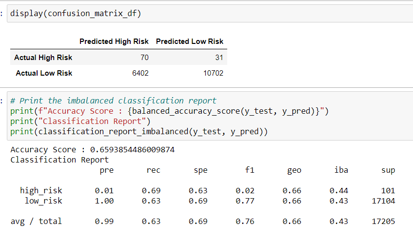
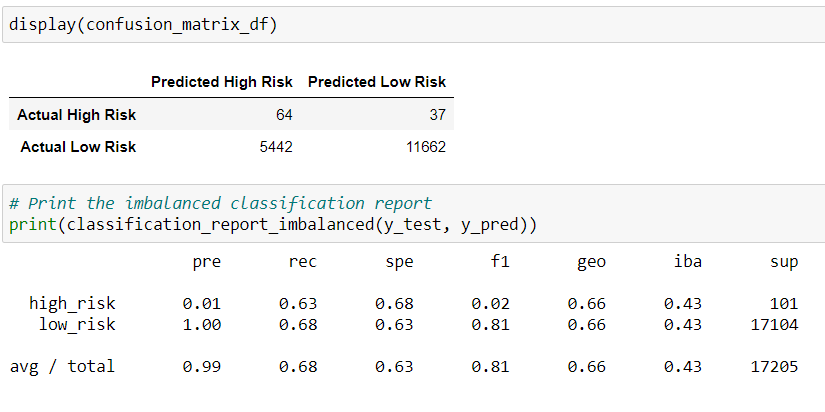
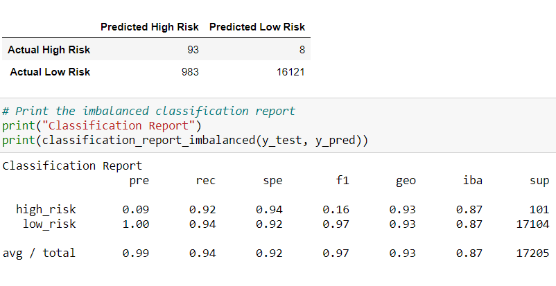

# Credit Risk Analysis

## **Overview**

This project is a mock scenario where Lending Club, a peer-to-peer lending services company, wants to use machine learning to predict credit risk. Management believes it&#39;s a great way to provide a quicker and more reliable loan experience. It will also lead to more accurate identification of good candidates for loans which will lead to lower default rates. Therefore, they hire a data analyst to implement their plan.

Using the credit card credit dataset, **Python** was used to build and evaluate several machine learning models to predict credit risk. Being able to predict credit risk with machine learning algorithms can help banks and financial institutions

Different techniques were deployed to train and evaluate models with unbalanced classes, using to **imbalanced-learn**  and  **scikit-learn**  libraries. Oversample was done using the  **RandomOverSampler**  and  **SMOTE**  algorithms, and undersampling using the  **ClusterCentroids**  algorithm. Then, combinatorial approach of over- and undersampling was done using the  **SMOTEENN**  algorithm. Later on, we compared the two new machine learning models that reduce bias using,  **BalancedRandomForestClassifier**  and  **EasyEnsembleClassifier**.

## **Results**

### 1. **Resampling Models to Predict Credit Risk**

- **Naive Random Oversampling**

- **SMOTE Oversampling**

- **Undersampling**

- **Combination (Over and Under) Sampling**
 Sampling.PNG)

### 2. **Ensemble Classifiers to Predict Credit Risk**

- **Balanced Random Forest Classifier**

- **AdaBoost Classifier**

